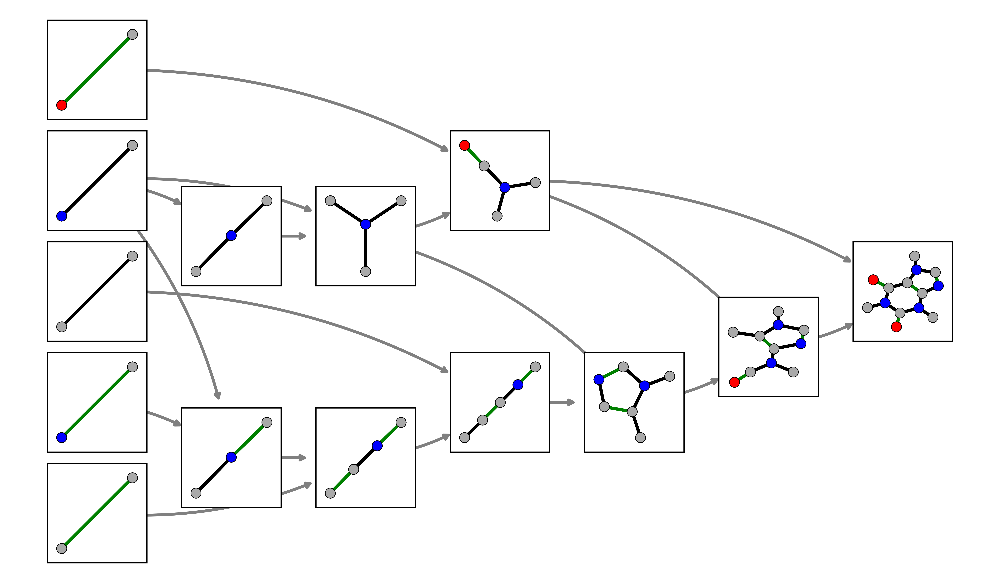

# `AssemblyTheoryTools` <!-- [](https://github.com/ELIFE-ASU/assemblytheorytools/stargazers)-->

A centralised set of tools for doing assembly theory calculations [\[1\]](#ref1) written in Python.
Reference coming soon!

## 🗺️ Overview

The aim is that this package provides a platform to do assembly theory calculations that work out of the box.
We currently interface with [C++](https://github.com/croningp/assemblycpp-v5) [\[2\]](#ref2)
and [Rust](https://github.com/DaymudeLab/assembly-theory) [\[3\]](#ref3) assembly calculators, and this package comes
with precompiled versions of both.
This version works best on Unix-based systems, and to use this package, it is strongly suggested that you use Linux
subsystem if you are using Windows.

AssemblyTheoryTools (ATT) is a Python package that facilitates assembly theory calculations
across various domains. It provides a unified interface to perform complex assembly theory computations,
leveraging the power of the underlying assembly calculators.

Assembly theory is a framework that aims to quantify the complexity of
objects by considering the minimal number of steps needed to assemble them
from their fundamental building blocks. It essentially treats objects not as simple
particles, but as entities defined by their possible formation histories, and it
provides a way to measure how much selection was required to produce a given
object or set of objects.

Currently, ATT supports and connects to:

- General undirected graphs via NetworkX.
- Molecules via RDKit.
- Directed and undirected strings.
- Approximate fast methods [assemblycfg](https://github.com/ELIFE-ASU/assemblycfg).

If you find this package useful, please cite the following papers:
Sharma _et al._ 2023 [\[1\]](#ref1) and Seet _et al._ 2024 [\[2\]](#ref2), found in the paper.bib.

## 🔧 Installing

Check out the requirements and installation instructions below.

The simplest way to install ATT is to use pip, which is the recommended package manager for Python. Installation is as
simple as,

```
pip install assemblytheorytools
```

The code needs a compiled assemblyCPP, which is included in this package by default.
However, if you want to use your version, you can set the `ASS_PATH` environmental
variable to the path of your AssemblyCPP installation.
For example, put `export ASS_PATH=/home/user/asscpp` in your submission
script or your `.bashrc`.
For compilation instructions to build your version from source, check out AssemblyCPP.

### ORCA - Optional

Components of this code use ORCA, a flexible, efficient, and easy-to-use general-purpose quantum chemistry program
package. ORCA is free for academic use but requires registration.

1. Go to the [ORCA Forum](https://orcaforum.kofo.mpg.de/) and register for an account.
2. Once registered, navigate to the "Downloads" section.
3. Download the appropriate version for your Linux system (e.g., `ORCA 6.1.1, Linux, x86-64, shared-linked, .tar.xz`).
4. Move the downloaded archive to your desired installation directory (e.g., `$HOME/orca_6_1_1`) and extract it.
5. Add the ORCA executable to `ORCA_PATH` to path so that ATT can point to it. For example, put
   `export ORCA_PATH=$HOME/orca_6_1_1/orca` in your submission
   script or your `.bashrc`.

## 💡 Example

For most use cases, the general calculation can be
exposed via the `calculate_assembly_index` function.

Here is a simple example for Caffeine. First, bring up a terminal
and activate the conda or pip environment where you installed ATT. Type in:

```
python3
```

In Python, first import the package:

```
import assemblytheorytools as att
```

Next, there are several ways to define a system. In this example case, we are
going to use a SMILES string which corresponds to Caffeine.

```
smi = 'CN1C=NC2=C1C(=O)N(C(=O)N2C)C'
```

Next, we must convert our SMILES string into a molecular graph.

```
graph = att.smi_to_nx(smi)
```

We are now ready to calculate the assembly index using the `calculate_assembly_index` function.
We will also get the virtual objects and the assembly path.

```
ai, virt_obj, pathway = att.calculate_assembly_index(graph, strip_hydrogen=True)
```

Here, the `ai` integer represents the assembly index,
`virt_obj` contains the virtual objects along the assembly path.
The `pathway` contains the assembly pathway used to calculate the assembly index.
The `pathway` is a directional graph where each node represents a virtual object,
and each edge represents a joining operation that combines input virtual objects
into one output virtual object.

Convert the virtual object graphs to a SMILES string.

```
virt_obj = [att.nx_to_smi(graph, add_hydrogens=False) for graph in virt_obj]
```

We should be able to print the results:

```
print(f"Assembly index: {ai}", flush=True)
print(f"virt_obj: {virt_obj}", flush=True)
```

We should see the output:

```
Assembly index: 9
virt_obj: ['C=NC=CC', 'CN(C)C', 'CN', 'CC1=CN=CN1C', 'CNC', 'C=O', 'C=NC', 'CN(C)C=O', 'CC', 'C=C', 'C=CN=C', 'CC1=C(N(C)C=O)N=CN1C', 'C=N', 'CN1C(=O)C2=C(N=CN2C)N(C)C1=O']
```

Let's plot the results.

```
att.plot_pathway(pathway, plot_type='graph')
plt.show()
```



## 💭 Feedback

### ⚠️ Issue Tracker

Found a bug? Have an enhancement request? Head over to the [GitHub issue
tracker](https://github.com/ELIFE-ASU/assemblytheorytools/issues) if you need to report
or ask something. If you are filing in on a bug, please include as much
information as possible about the issue, and try to recreate the same bug
in a simple, easily reproducible situation.

### 🏗️ Contributing

Contributions of all kinds—bug reports, feature suggestions, code improvements, and documentation updates - are welcome!
See
[`CONTRIBUTING.md`](https://github.com/ELIFE-ASU/assemblytheorytools/blob/main/CONTRIBUTING.md)
for more details.

## 👥 Contributors

Louie Slocombe, orchestration, development, and conceptualisation.

Gage Siebert, string assembly index calculations and CFG integration.

Estelle Janin, bonding and joint assembly index calculations.

Joey Fedrow, development, maintenance, and documentation.

Veronica Mierzejewski, integration of reassembly calculations.

Mohammadreza Shahjahan, branding, development.

Marina Fernandez-Ruz, visualisation and circle plots.

Sebastian Pagel, reassembly calculations and visualisation.

Amit Kahana, recursive MA integration.

Stuart Marshall, debugging and optimization.

Ian Seet, joining operations index calculations.

Keith Patarroyo, assembly path reconstruction and visualisation.

Michael Jirasek, mass spectrometry measurement pipeline.

Abhishek Sharma, administrative support.

Lee Cronin, conceptual, funding, and administrative support.

Sara Walker, conceptual, funding, and administrative support.

## ⚖️ License

MIT License. We ask that you cite the relevant papers, please!

## 📚 References

- <a id="ref1">\[1\]</a> Sharma, A., Czégel, D., Lachmann, M., Kempes, C. P., Walker, S. I., & Cronin, L. (2023).
  Assembly theory explains and quantifies selection and evolution. Nature, 622(7982),
  321-328. [doi:10.1038/s41586-023-06600-9](https://doi.org/10.1038/s41586-023-06600-9).
- <a id="ref2">\[2\]</a> Seet, I., Patarroyo, K. Y., Siebert, G., Walker, S. I., & Cronin, L. (2024). Rapid computation
  of the assembly index of molecular graphs. arXiv preprint arXiv:2410.09100. [doi:10.48550/arXiv.2410.09100](
  https://doi.org/10.48550/arXiv.2410.09100).
- <a id="ref3">\[3\]</a> https://github.com/DaymudeLab/assembly-theory

## 🛠️ Full installation instructions

<details>
<summary>Local</summary>
<br>

### Fresh environment

It is recommended that you start from a fresh environment to prevent issues.

```
conda create -n ass_env python=3.13
```

Activate the new env.

```
conda activate ass_env
```

Add channels in this order.

```
conda config --env --add channels conda-forge
```

Best to make the channels strict to prevent conflicts.

```
conda config --set channel_priority true
```

To check your updated channel list.

```
conda config --show channels
```

Make sure to upgrade the conda env to force the channel priority.

```
conda update conda --all -y
```

#### Install the requirements.

```
conda install numpy scipy matplotlib networkx rdkit pyvis ase -y
```

Then, install the ELIFE packages.

```
pip install git+https://github.com/ELIFE-ASU/dagviz.git assemblycfg
```

Then, install AssemblyTheoryTools.

```
pip install assemblytheorytools
```

</details>

<details>
<summary>Development</summary>
<br>

It is recommended that you start from a fresh environment to prevent issues.

```
conda create -n ass_env python=3.13
```

Activate the new environment.

```
conda activate ass_env
```

Add channels in this order.

```
conda config --env --add channels conda-forge
```

Best to make them strict.

```
conda config --set channel_priority true
```

Make sure to upgrade the conda env to force the channel priority.

```
conda update conda --all -y
```

Install the requirements.

```
conda install numpy scipy matplotlib networkx rdkit pyvis ase pytest -y
```

Then, install the ELIFE packages.

```
pip install git+https://github.com/ELIFE-ASU/dagviz.git assemblycfg
```

Clone the repo using Git or GitKraken. Then, open your favourite IDE (PyCharm/VS Code) and the cloned repo.

</details>

<details>
<summary>HPC-SOL</summary>
<br>

Load Mamba

```
module load mamba/latest
```

It is recommended that you start from a fresh environment to prevent issues.

```
mamba create -n ass_env -c conda-forge python=3.13 
```

Activate the new env.

```
source activate ass_env
```

Install all the dependencies. If it kills, feel free to split the installs.

```
mamba install -c conda-forge numpy scipy matplotlib networkx rdkit pyvis ase -y
```

Install AssemblyTheoryTools.

```
pip install assemblytheorytools
```

When running on an HPC, you should run Python using the absolute path to the directory, for example:
`srun $HOME/.conda/envs/myEnv/bin/python3`

</details>

<details>
<summary>Manual assemblycpp instructions using Intel oneAPI</summary>
<br>

Manually compiling assemblycpp using the oneAPI can result in significantly faster code if you have an Intel chipset.
Installing Intel oneAPI, look for an
offline [installer](https://www.intel.com/content/www/us/en/developer/tools/oneapi/dpc-compiler-download.html?operatingsystem=linux&distribution-linux=offline)

```
bash ./intel-dpcpp-cpp-compiler-2025.0.4.20_offline.sh
```

Source the env.

```
source /home/louie/intel/oneapi/setvars.sh
```

Get the boost code.

```
wget https://archives.boost.io/release/1.89.0/source/boost_1_89_0.tar.gz
```

Uncompress.

```
tar -xvzf boost_1_89_0.tar.gz
```

Remove the tar file.

```
rm -rf boost_1_89_0.tar.gz
```

Get the assemblycpp code.

```
git clone --branch script https://github.com/LouieSlocombe/assemblycpp-v5.git
```

Change into the code directory.

```
cd assemblycpp-v5/v5/
```

Compile.

```
icpx main.cpp -o asscpp -I $HOME/boost_1_89_0/ -O3 -ipo -xHost -ffast-math -qopt-zmm-usage=high -fno-alias
```

Add the file to your .bashrc.

```
export ASS_PATH=$HOME/assemblycpp-v5/v5/asscpp
```

</details>

<details>
   <summary>Dependencies</summary>
   <br>
   All testing performed in python 3.12. Dependent packages are as follows:
   ase>=3.23.0, numpy>=2.1.3, scipy>=1.15.1, pandas>=2.2.3, matplotlib>=3.9.2, networkx>=3.4.2, rdkit>=2024.03.5, ipython>=8.30.0, pyvis>=0.3.2, pubchempy>=1.0.5, cairosvg>=2.8.2, dagviz>=0.5.0, assembly-theory>=0.6.0, assemblycfg>=1.2.2
</details>
